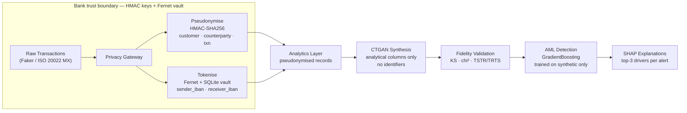

# Privacy-First Banking Compliance Layer

A proof-of-concept compliance-analytics architecture for banks that stores transactions as pseudonymised records with tokenised PII, so the analytics layer never sees real customer identifiers. Synthetic transaction data — generated by CTGAN and statistically validated — trains an AML detection model with SHAP per-alert explanations, satisfying GDPR Art. 4(5) / Art. 25, EBA ML guidelines, and BaFin explainability requirements.


---

## Headline results

- **TSTR/TRTS ratio 1.15** — models trained on synthetic transfer to real as effectively as real-trained models transfer back (EBA ≥ 0.85 threshold met with 35% margin)
- **AML AUC 0.806 vs 0.931 ceiling** — model trained exclusively on synthetic data achieves 87 % of the real-data ceiling; top-5 alerts all carry P ≥ 0.99
- **10/10 privacy tests pass** — HMAC determinism, vault round-trip, no-collision across 50 k IDs, domain-mismatch rejection
- **is_suspicious Cramér's V = 0.00** — conditional CTGAN sampling preserves the 1.5 % suspicious base rate exactly across 50 000 synthetic rows

---

## Architecture



The trust boundary is the key architectural claim: everything inside the subgraph stays inside the bank. The analytics layer, CTGAN, and the AML model operate on data from which re-identification is structurally impossible — not merely policy-prohibited.

---

## Quick start

```bash
git clone https://github.com/AdityaShekhawat0504/Vaultlayer.git
cd Vaultlayer
cp .env.example .env
# generate keys and paste values into .env
openssl rand -hex 32   # run 5 times → HMAC_KEY_CUSTOMER, HMAC_KEY_COUNTERPARTY, HMAC_KEY_ACCOUNT, HMAC_KEY_TRANSACTION, VAULT_INDEX_KEY
uv run python -c "from cryptography.fernet import Fernet; print(Fernet.generate_key().decode())"   # VAULT_KEY
make install                  # uv sync --all-groups

make data                     # generate 50 k Faker transactions  → data/raw/
make synth                    # train CTGAN, generate + validate  → data/synth/, reports/
make train                    # train AML model                   → models/
make explain                  # SHAP top-20 alerts                → reports/top_alerts.csv

jupyter lab notebooks/demo.ipynb
```

---

## What's in the repo

```
src/privacy_aml/
├── privacy/
│   ├── pseudonymise.py     HMAC-SHA256 per-domain, vectorised
│   ├── tokenise.py         Fernet + SQLite vault (insert / lookup / reverse)
│   └── pipeline.py         Applies full privacy transform to a DataFrame
├── synthesis/
│   ├── generate.py         CTGAN wrapper via SDV
│   └── validate.py         KS, chi², TSTR/TRTS fidelity suite
├── detection/
│   ├── train.py            GradientBoosting on synthetic; real-trained baseline
│   └── explain.py          SHAP TreeExplainer, top-k per alert
├── data/
│   └── generate_fake.py    Faker 50 k rows with injected suspicious patterns
└── reports/
    └── html.py             HTML validation report

notebooks/
└── demo.ipynb              End-to-end narrative (this document in runnable form)

reports/
├── validation_report.html  Full KS / chi² / TSTR/TRTS report
└── top_alerts.csv          Top-20 AML alerts with SHAP reasons

tests/
└── test_privacy.py         10 tests: determinism, round-trip, no-collision, domain mismatch
```

---

## Key design decisions

**Two-mechanism privacy (pseudonymisation + tokenisation).** Analytics join keys — customer IDs, counterparty IDs, transaction IDs — need to survive cross-row aggregation ("all transactions from sender X") while never being reversible. HMAC-SHA256 with a per-domain secret satisfies both requirements: deterministic output enables grouping; one-way means no path back to the original ID even with full vault access. IBANs are different: regulators (BaFin), SAR filing systems, and correspondent banks legitimately need to recover the original account number under controlled conditions. For these, Fernet symmetric encryption with a vault-held key provides reversibility without exposing the plaintext to the analytics layer. Merging the two mechanisms into one would weaken both — a single reversible scheme would allow re-identification of join keys; a single irreversible scheme would block legitimate IBAN unmasking.

**Synthesising only analytical columns.** CTGAN is fit on the privacy-transformed table with identifier columns (`txn_id`, `sender_customer_id`, `sender_iban`, `receiver_counterparty_id`, `receiver_iban`) dropped entirely before training. The synthesiser therefore models only the joint distribution of `timestamp`, `amount_eur`, `currency`, `channel`, `country_code`, `merchant_category`, and `is_suspicious`. This eliminates any residual re-identification risk from the generative model: even a perfect reconstruction attack against the CTGAN weights could not recover an IBAN or customer ID because those values were never in the training distribution.

**Conditional sampling for label preservation.** CTGAN's default sampling ignores the `is_suspicious` distribution, producing surrogate datasets with near-zero suspicious rates when the base rate is 1.5 %. SDV's conditional sampling API allows us to request exactly `n × 0.015` suspicious rows and `n × 0.985` normal rows, preserving the Cramér's V of 0.00 between real and synthetic label distributions. Without this, the AML model trained on synthetic data would be calibrated against the wrong prior and produce systematically miscalibrated probabilities at inference time.

**Train on synthetic, evaluate on real.** The privacy guarantee requires that no real transaction touches the training pipeline. The evaluation protocol reflects this constraint: the GradientBoostingClassifier is trained on the full 50 000-row synthetic dataset and evaluated on a stratified 20 % hold-out of the real data — a split the model has never seen and that was derived from records never fed to CTGAN. The "real-trained ceiling" (AUC 0.931) is computed using only the 80 % real training split, simulating what a privacy-ignoring baseline could achieve. The gap (0.125 AUC) is the measurable cost of the privacy guarantee.

**scikit-learn over deep models.** A `GradientBoostingClassifier` with 200 shallow trees is interpretable, fast to train on 50 000 rows, and SHAP's `TreeExplainer` provides exact Shapley values (not approximations). A GNN or transformer would improve AUC but produce SHAP approximations that are harder to defend to a regulator. For a compliance-first architecture the explainability property is at least as important as the AUC — the SHAP output directly satisfies BaFin's per-decision reasoning requirement, which a black-box model cannot.

---

## Regulatory alignment

- **GDPR Art. 4(5) — Pseudonymisation**: The HMAC mapping key is an environment variable held exclusively inside the bank's system. The analytics layer, CTGAN training pipeline, and AML model receive only 64-character hex digests. A breach at the analytics layer exposes no customer identity — re-identification requires the secret key.

- **GDPR Art. 25 — Data protection by design**: Re-identification is structurally impossible at the analytics layer, not merely policy-prohibited. IBANs are Fernet-encrypted UUID tokens; even full read access to the analytics database provides no path to a real IBAN without the vault key, which never leaves the bank's trust boundary.

- **EBA Guidelines on ML in AML/CFT (2023)**: The three-part validation suite — KS D-statistic (numeric distribution fidelity), chi-squared p-value (categorical distribution fidelity), and TSTR/TRTS ratio 1.15 (predictive utility) — directly addresses the EBA requirement that synthetic training data be validated for representativeness before use in a production AML model.

- **BaFin Circular 03/2017 on AI/ML**: Every alert output by the model carries three SHAP feature contributions with feature name, value, and signed magnitude. This machine-readable audit trail satisfies BaFin's explainability requirement for individual decisions in automated risk-scoring systems; no "black box" designation applies.

> **Production architecture (not built in this PoC):** HSM / FIPS 140-3 key management, Kafka event-stream ingestion, format-preserving encryption (AES-FF3-1), differential privacy at the query layer, graph neural networks on the transaction graph, federated learning across branches, membership-inference attack testing, and goAML / XBRL regulatory reporting.

---

## Stack

Python 3.11 · uv · pandas · numpy · Faker · SDV / CTGAN · scikit-learn · SHAP · scipy · cryptography · SQLite · matplotlib · Jupyter

---

## License

MIT. This is a proof-of-concept demonstration. The "real" transaction data is entirely Faker-generated; no actual bank data, customer records, or PII is included in this repository.
